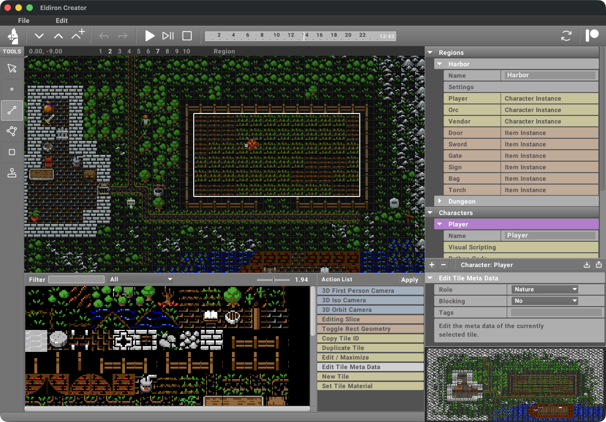
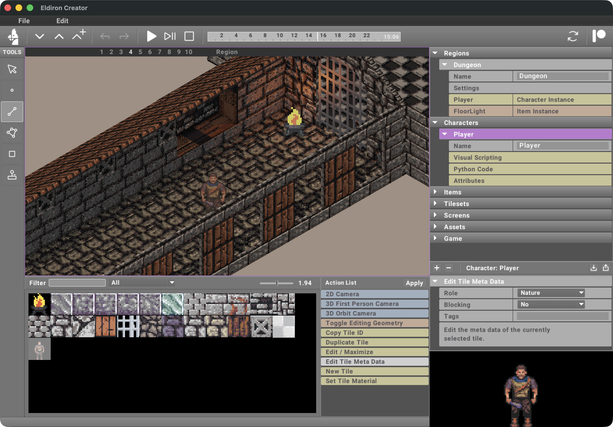

# Developer

This project is developed by **Stephen Deline Jr**.

# Version

Current version: 0.8.100

# Enchentment Engine: Next-Generation Classical RPG Creation Suite
**Enchentment Engine** is a cross-platform, open-source engine for classic retro role-playing games (RPGs). It empowers you to build 2D, isometric, and first-person RPGs reminiscent of the 1980s and 1990s, while supporting modern features like multiplayer, procedural content, and more.
cargo install enchentment_engine-creator
cargo install enchentment_engine-client
# (This project
supports **2D** (Ultima-style), **isometric** (Diablo-style), and **first-person** (Dungeon Master/Eye of the Beholder-style) RPG creation
**Enchentment Engine**  is a cross-platform engine for classic retro role-playing games (RPGs). Its primary goal is to enable the creation of RPGs reminiscent of the 1980s and 1990s while incorporating modern features such as multiplayer support, procedural content generation, and more.
Enchentment Engine natively supports **2D** (Ultima-style), **isometric** (Diablo-style), and **first-person** MMROPG, RPGs, allowing developers to craft a variety of experiences effortlessly.
Enchentment Engine is built on three embedded crates that I have developed over the last years. Each focuses on a specific aspect of the engine and editor, and together they form the foundation of the Enchentment Engine ecosystem.
Handles cross-platform window creation, user event abstraction, and the custom UI system used by *Enchentment Engine*.
Started as a software rasterizer for 2D and 3D geometry, but has since evolved into the core game engine. While *SceneVM* now handles most rendering tasks, the software rasterization aspect of Rusterix is still used for example in in-game UI elements.
An abstracted, layer-based renderer for 2D and 3D built on top of [wGPU](https://wgpu.rs). Each layer can define its own geometry and compute shaders, making SceneVM the main rendering backbone of the engine.
Over the past five years, Enchentment Engine (formerly Eldiron Creator) has gone through several major iterations. As a result, some parts of the code are in the process of being consolidated or phased out as the project moves toward a cleaner v1 architecture.

# Enchentment Engine: Next-Generation Classical RPG Creator

![Windows]

## Overview


**Enchentment Engine** is a next-generation, open-source RPG creation suite designed for both hobbyists and professional developers. Built in Rust for performance and reliability, it enables the creation of classic and modern role-playing games with ease and flexibility.

### Modular Themes, Skins, and Layouts
Enchentment Engine features a fully modular GUI system. Users can:
- Choose from multiple built-in themes and skins, or create their own
- Switch between light, dark, and custom color schemes
- Configure the layout of toolbars and panels: dock tools to the left, right, top, or bottom, or use floating/detachable windows
- Save and load personalized workspace layouts
- Access all theme and layout options directly in the settings dialog

This flexibility ensures the editor adapts to your workflow, whether you prefer a classic RPG toolkit look or a modern, streamlined interface.

### What is Enchentment Engine?
Enchentment Engine is a modular, cross-platform toolkit for building 2D, isometric, and first-person RPGs. Inspired by the golden era of RPGs, it combines retro aesthetics with modern technology, supporting:

- **2D, isometric, and first-person perspectives**
- **Procedural content generation** for endless replayability
- **Multiplayer support** for co-op and online experiences
- **Customizable UI and event system**
- **Flexible rendering** (software and GPU via wGPU)
- **Extensible toolset**: asset browser, map editor, monster/item/loot editors, animation, stat curve visualizer, procedural rule editor, and more
- **Modular themes/skins and layouts**: fully customizable appearance and dockable toolbars (left, right, top, bottom, floating)
- **Powerful undo/redo and project history**
- **Localization/i18n** with Fluent
- **User/project settings and save/export tools** (including theme/layout options)
- **Open-source (MIT License)**

### Why Choose Enchentment Engine?
- **All-in-one RPG toolkit**: Everything you need to create, test, and export your RPG projects
- **Modern Rust codebase**: Fast, safe, and easy to extend
- **Active community and documentation**: Comprehensive docs, modular code, and open contribution model
- **Cross-platform**: Windows, macOS, Linux
- **Designed for creators**: From solo devs to teams, with a focus on usability, flexibility, and a personalized workspace

### About the Project
Enchentment Engine is the result of years of development and iteration, bringing together a suite of custom Rust crates for rendering, UI, and game logic. It is designed to be both approachable for newcomers and powerful for advanced users, with a modular architecture that encourages extension and customization.

Whether you want to recreate the feel of classic RPGs or push the boundaries with new mechanics and visuals, Enchentment Engine provides the foundation and tools to bring your vision to life.

## Screenshots

2D Example           | 3D Example
:-------------------------:|:-------------------------:
  |  

## Architecture

Enchentment Engine is built on a modular Rust codebase:


## Getting Started

### Install via Cargo
If you have [Rust installed](https://www.rust-lang.org/tools/install):

```bash
cargo install enchentment_engine-creator
cargo install enchentment_engine-client
```

### Linux Dependencies
Install: `libasound2-dev` `libatk1.0-dev` `libgtk-3-dev`

## Project Milestones & CI/CD

- Automated builds are set up using GitHub Actions. See `.github/workflows/` for configuration.
- First milestone: Complete core engine loop, rendering, and input subsystems.
- Error handling is reviewed and improved in all major modules.
- Core components (Render, Input) are expanded for flexibility and extensibility.
- Real subsystems (Logging, Input) are implemented and integrated.
- Architecture and usage are documented throughout the codebase and in this README.
- A developer/contributor guide is provided in `CONTRIBUTING.md`.
- Watabou-style map engine is scaffolded with layout, tools, logic, and functions in `engine/map/`.

## Getting Started

- Clone the repository and run `cargo build` to build the engine.
- See `src/main.rs` for integration demos and usage examples.
- For contributing, see `CONTRIBUTING.md`.

## Contributing

## License
MIT License. All assets are MIT unless otherwise stated.

## Support

For more info, visit [enchentmentengine.com](https://enchentmentengine.com)
#
# (This project was formerly known as Eldiron)

## Features Overview
**Enchentment Engine** offers:

- 2D, isometric, and first-person RPG creation
- Modern multiplayer support
- Procedural content generation
- Modular, extensible engine architecture
- Flexible rendering (software & GPU)
- Cross-platform (Windows, macOS, Linux)
- Custom UI and event system
- Modular themes, skins, and layouts (dockable toolbars: left, right, top, bottom, floating)
- Full theme/layout selection and customization in settings
- Open-source (MIT License)

## Features

- Modular Unreal-style engine architecture in Rust
- Core systems: actors, components, world, plugins, subsystems
- Advanced map engine: procedural, import/export, watabou-style
- 2D and 3D map visualization (renderers, cameras, overlays)
- World, kingdom, city, biome, building, place, and planet modules
- Extensible for procedural generation, editing, and visualization

## Getting Started

- Build: `cargo build`
- Run: `cargo run`
- See `DEVELOPER_GUIDE.md` for architecture and usage

## Example

```rust
use engine::map::generator::MapGenerator;
let map = MapGenerator::generate_basic_map(16, 16);
```

## AI System Usage Example

The engine includes a modular AI system with both a Finite State Machine (FSM) and a Goal-Oriented Planner. Below is a quick usage example, as integrated in `src/main.rs`:

```rust
use engine::ai;

fn ai_demo() {
    // FSM Example
    let mut fsm = ai::fsm::Machine::new();
    let idle = ai::fsm::State::new("Idle");
    let walk = ai::fsm::State::new("Walk");
    fsm.add_state(idle.clone());
    fsm.add_state(walk.clone());
    fsm.add_transition(ai::fsm::Transition::new("Idle", "Walk", "start_walking"));
    fsm.set_current("Idle");
    println!("FSM current state: {:?}", fsm.get_current());
    fsm.update("start_walking");
    println!("FSM current state after update: {:?}", fsm.get_current());

    // Planner Example
    let mut plan = ai::planner::Plan::new();
    plan.add_action(ai::planner::Action::new("MoveTo"));
    plan.add_action(ai::planner::Action::new("Attack"));
    plan.execute();
}
```

- The FSM manages states and transitions for AI agents.
- The Planner allows you to queue and execute actions to achieve goals.

See the `engine/ai/` folder for more details and extend as needed for your game logic.

## Logging and Input Subsystems

The engine provides basic logging and input handling out of the box:

```rust
use engine::core;

fn main() {
    core::logging::log("Engine started");
    core::input::process_input("KeyPress:W");
}
```

- Logging: Use `core::logging::log()` for simple log output.
- Input: Use `core::input::process_input()` to handle input events.

## Contributing

- See `DEVELOPER_GUIDE.md` for guidelines
- PRs and issues welcome!

