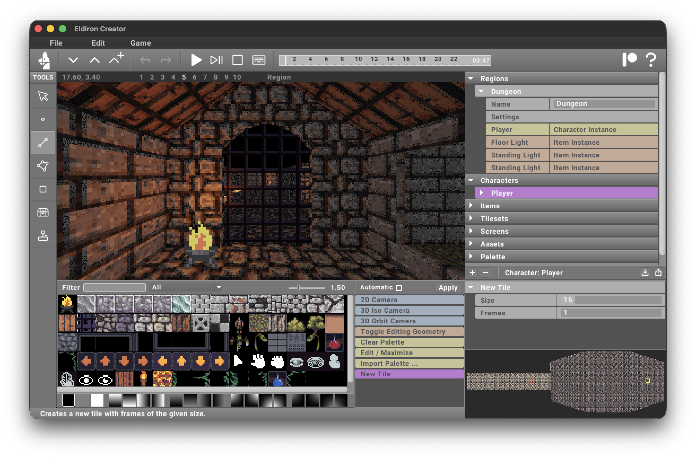

# Enchantmen Engine Creator

**Enchantmen Engine** is a cross-platform creator for classic retro role-playing games (RPGs). Its primary goal is to enable the creation of RPGs reminiscent of the 1980s and 1990s while incorporating modern features such as multiplayer support, procedural content generation, and more.

Enchantmen Engine natively supports **2D** (like Ultima 4/5), **isometric**, and **first-person** RPGs, allowing developers to craft a variety of experiences effortlessly.



Enchantmen Engine is open-source and licensed under the **MIT License**.

```bash
cargo install enchantmen-creator
```

## License

Licensed under the MIT License.
